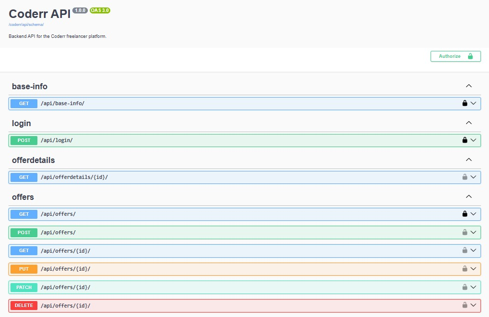

# Coderr Backend

A RESTful backend for **Coderr**, a freelancer service marketplace.
It provides token-authenticated endpoints for business users to publish
service offers, for customers to order and review them, and for platform-wide
statistics, built with Django and the Django REST Framework.

👉 **[Live demo](https://coderr.benjaminblarr.de/)** ·
**[API documentation](https://coderr.benjaminblarr.de/api/schema/swagger-ui/)**



The login page offers guest access for both user types, so the demo can be
explored without registering. The frontend is provided by the Developer
Akademie; everything behind `/api/` is this project.

---

## Features

- Token-based authentication (registration & login)
- Two user types with dedicated profiles: **business** and **customer**
- Offers, each with exactly three tiers (**basic**, **standard**, **premium**)
- Orders created from an offer tier as an immutable snapshot
- Reviews (at most one per business per customer)
- Order statistics (in-progress / completed counts) and platform base info
- Filtering, searching, ordering and pagination on the offers list
- Object-level permissions (owner / creator / business / customer rules)
- Auto-generated OpenAPI 3 documentation (Swagger UI & ReDoc) via drf-spectacular

---

## Tech Stack

**Backend**

<p align="left">
  
  
  
  
  
</p>

**Infrastructure**

<p align="left">
  
  
  
  
  
</p>

| Component  | Version                                      |
| ---------- | -------------------------------------------- |
| Language   | Python 3.12+ (required by Django 6)          |
| Framework  | Django 6.0.6                                 |
| API        | Django REST Framework 3.17.1                 |
| Database   | SQLite (development) / PostgreSQL (production)|
| Auth       | DRF Token Authentication                     |
| API Docs   | drf-spectacular 0.30.0 (OpenAPI 3)           |
| Serving    | Gunicorn behind Nginx (Ubuntu 24.04)         |

---

## Project Structure

```
coderr_backend/
├── core/          # Project settings, root URL config, WSGI/ASGI
├── auth_app/      # Registration, login, profiles
│   └── api/       # serializers.py, views.py, urls.py, permissions.py
├── offers_app/    # Offers and offer details
│   └── api/       # serializers.py, views.py, urls.py, permissions.py, pagination.py
├── orders_app/    # Orders and order statistics
│   └── api/       # serializers.py, views.py, urls.py, permissions.py
├── reviews_app/   # Reviews
│   └── api/       # serializers.py, views.py, urls.py, permissions.py
├── base_app/      # Aggregated platform statistics (base-info)
│   └── api/       # views.py, urls.py
├── manage.py
└── requirements.txt
```

---

## Getting Started

### Prerequisites

- Python 3.12 or newer
- `pip` and `venv`

### Installation

1. **Clone the repository**

   ```bash
   git clone https://github.com/B-Blarr/Coderr-Backend.git
   cd Coderr-Backend
   ```

2. **Create and activate a virtual environment**

   ```bash
   python -m venv .venv
   ```

   Activate it. **Windows (PowerShell):**

   ```powershell
   .\.venv\Scripts\Activate.ps1
   ```

   **macOS / Linux:**

   ```bash
   source .venv/bin/activate
   ```

3. **Install the dependencies**

   ```bash
   pip install -r requirements.txt
   ```

4. **Set up your environment file**, copy the provided template, then set
   your own secret key. The `.env` file itself is git-ignored.

   Windows (PowerShell):

   ```powershell
   Copy-Item .env.example .env
   ```

   macOS / Linux:

   ```bash
   cp .env.example .env
   ```

   Then open `.env` and replace the value with your own `SECRET_KEY`. You can
   generate one with:

   ```bash
   python -c "from django.core.management.utils import get_random_secret_key; print(get_random_secret_key())"
   ```

5. **Apply the database migrations**

   ```bash
   python manage.py migrate
   ```

6. **(Optional) Create an admin user** to use the Django admin at `/admin/`:

   ```bash
   python manage.py createsuperuser
   ```

7. **(Optional) Seed demo data**, six offers, five reviews and the guest
   accounts the frontend expects:

   ```bash
   python manage.py seed_demo
   ```

   The command is idempotent and runs in a transaction, so it can be repeated
   safely.

8. **Run the development server**

   ```bash
   python manage.py runserver
   ```

   The API is now available at `http://127.0.0.1:8000/`.

Without any environment variables set, the project runs in development mode:
`DEBUG=True` and a local SQLite file. Production settings are switched on
purely through the `.env` file.

---

## Tests

Run the full test suite:

```bash
python manage.py test
```

Measure test coverage (target: **≥ 95 %**):

```bash
coverage run --source=auth_app,offers_app,orders_app,reviews_app,base_app --omit='*/migrations/*,*/tests/*' manage.py test
coverage report
```

---

## Authentication

The API uses **token authentication**. Register or log in to receive a token,
then send it with every authenticated request in the `Authorization` header:

```
Authorization: Token <your-token>
```

Registration and login responses both return:

```json
{
  "token": "...",
  "username": "max",
  "email": "max@example.com",
  "user_id": 1
}
```

> **Note:** logging in is done with the `username`, not the email address.

---

## API Documentation

Interactive, auto-generated API documentation is available while the server is
running:

| View       | URL                            |
| ---------- | ------------------------------ |
| Swagger UI | `/api/schema/swagger-ui/`      |
| ReDoc      | `/api/schema/redoc/`           |
| Raw schema | `/api/schema/`                 |

---

## API Endpoints

Base path: `/api/`

### Authentication

| Method | Endpoint          | Description                | Auth |
| ------ | ----------------- | -------------------------- | ---- |
| POST   | `/registration/`  | Create a new user          | No   |
| POST   | `/login/`         | Log in and obtain a token  | No   |

### Profiles

| Method | Endpoint                  | Description                     | Permission     |
| ------ | ------------------------- | ------------------------------- | -------------- |
| GET    | `/profile/{pk}/`          | Profile detail                  | Authenticated  |
| PATCH  | `/profile/{pk}/`          | Update own profile              | Owner only     |
| GET    | `/profiles/business/`     | List all business profiles      | Authenticated  |
| GET    | `/profiles/customer/`     | List all customer profiles      | Authenticated  |

### Offers

| Method | Endpoint               | Description                              | Permission     |
| ------ | ---------------------- | ---------------------------------------- | -------------- |
| GET    | `/offers/`             | List offers (filter/search/order, paged) | Public         |
| POST   | `/offers/`             | Create an offer (exactly 3 details)      | Business only  |
| GET    | `/offers/{id}/`        | Offer detail                             | Authenticated  |
| PATCH  | `/offers/{id}/`        | Update an offer                          | Creator only   |
| DELETE | `/offers/{id}/`        | Delete an offer                          | Creator only   |
| GET    | `/offerdetails/{id}/`  | Single offer detail                      | Authenticated  |

### Orders

| Method | Endpoint                                    | Description                    | Permission        |
| ------ | ------------------------------------------- | ------------------------------ | ----------------- |
| GET    | `/orders/`                                  | List the user's orders         | Authenticated     |
| POST   | `/orders/`                                  | Create an order from a detail  | Customer only     |
| PATCH  | `/orders/{id}/`                             | Update the order status        | Business only     |
| DELETE | `/orders/{id}/`                             | Delete an order                | Admin / staff     |
| GET    | `/order-count/{business_user_id}/`          | Count of in-progress orders    | Authenticated     |
| GET    | `/completed-order-count/{business_user_id}/`| Count of completed orders      | Authenticated     |

### Reviews

| Method | Endpoint          | Description                          | Permission     |
| ------ | ----------------- | ------------------------------------ | -------------- |
| GET    | `/reviews/`       | List reviews (filter / order)        | Authenticated  |
| POST   | `/reviews/`       | Create a review (one per business)   | Customer only  |
| PATCH  | `/reviews/{id}/`  | Update a review                      | Creator only   |
| DELETE | `/reviews/{id}/`  | Delete a review                      | Creator only   |

### Base Info

| Method | Endpoint       | Description                    | Permission |
| ------ | -------------- | ------------------------------ | ---------- |
| GET    | `/base-info/`  | Platform-wide statistics       | Public     |

---

## Conventions & Notes

- **User model:** The project uses a custom user (`auth_app.User`, extending
  `AbstractUser`). Profile fields (`first_name`, `last_name`, `location`, `tel`,
  `description`, `working_hours`) live directly on the user.
- **User `type`:** one of `customer` or `business`.
- **Profile fields are never `null`:** missing values are returned as empty
  strings `""`.
- **Offer `offer_type`:** one of `basic`, `standard`, `premium`. Every offer has
  exactly three details, one per type.
- **Order `status`:** one of `in_progress`, `completed`, `cancelled`.
- **Orders are snapshots:** creating an order copies the chosen offer detail's
  fields (title, price, features, …); there is no foreign key back to the detail,
  so later changes to the offer do not affect existing orders.
- **Reviews:** a customer may leave at most one review per business user.
- **`average_rating`** in the base-info response is rounded to one decimal place.
- **Offers list query params:** `creator_id`, `min_price`, `max_delivery_time`,
  `search` (title/description), `ordering` (`updated_at` | `min_price`) and
  `page_size`. The response is paginated (`count`, `next`, `previous`, `results`).

---

## Deployment

The live instance runs on a VPS I set up and maintain myself: Ubuntu 24.04,
Nginx as the reverse proxy, Gunicorn serving Django over a Unix socket,
PostgreSQL as the database and TLS certificates from Let's Encrypt. Database
and media backups run nightly through a systemd timer.

The complete runbook is in [DEPLOYMENT.md](DEPLOYMENT.md): every step from an
empty server to the running site, the configuration files, and a section on
the mistakes that actually happened along the way.
